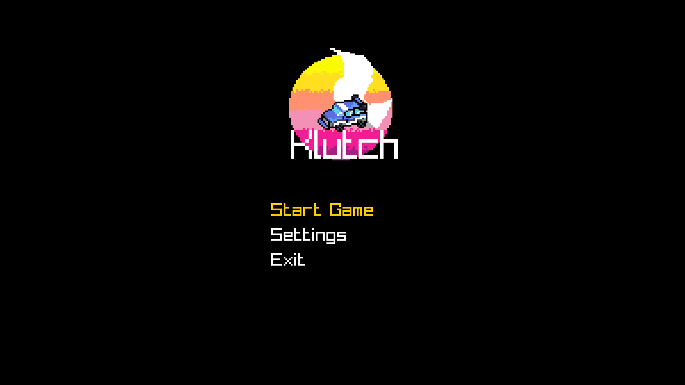
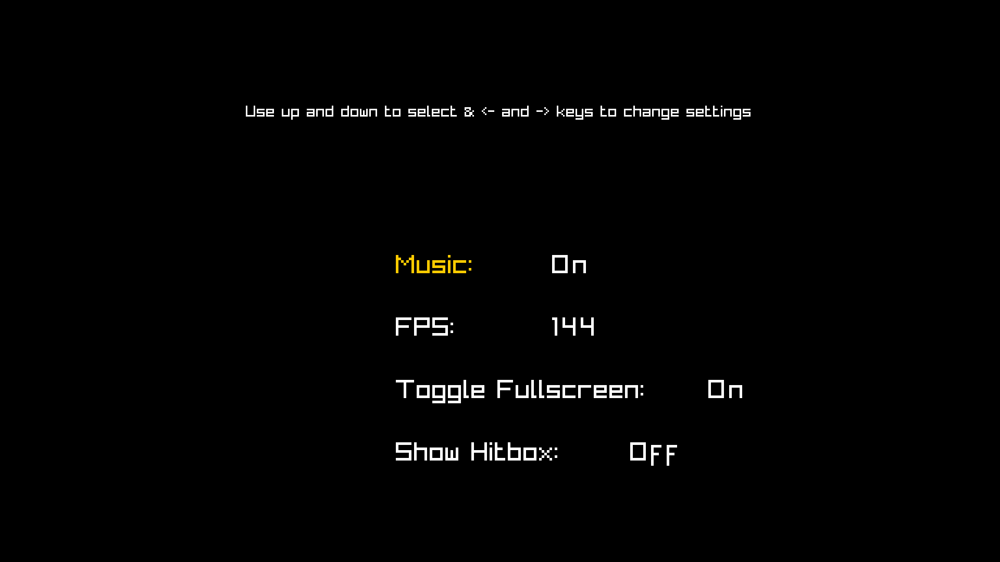

# 🏎️ Top-Down Racing Game

A fast-paced **2D top-down racing game** built from scratch using **[Raylib](https://www.raylib.com/)**—no full game engine involved! Test your reflexes, survive as long as possible, and climb the leaderboard with your high scores.  

---

## 🎮 Features

- **Random Enemy Spawning** – Every playthrough is unique, keeping the game challenging and replayable.  
- **Multiple Difficulty Modes** – Choose between **Easy** and **Hard** modes for different levels of challenge.  
- **Score System** – The longer you survive, the higher your score. Compete against yourself or friends!  
- **Smooth 2D Top-Down Racing Mechanics** – Responsive controls for tight turns and fast-paced racing.  

---

## 🖼️ Screenshots

  
  

_Add more screenshots as you update your game!_  

---

## 🏆 Scoring System

- Survive as long as possible.  
- **Score increases over time**.  
- Compete for the **highest score** on Easy and Hard modes.  

---

## 🎨 Game Assets

- All sprites, music, and sounds are included in the `assets` folder.  
- You can replace them with your own custom assets if desired.  

---

## 📈 Future Improvements

- Add power-ups and bonuses.  
- Introduce multiple tracks and themes.  
- Implement a leaderboard system.  
- Add more enemy types with different behaviors.  

---

## 💻 Built With

- [C++](https://isocpp.org/)  
- [Raylib](https://www.raylib.com/) – Lightweight C library for game development  

---

## 🤝 Contributing

Contributions are welcome! Feel free to:  

- Submit bug reports  
- Suggest features  
- Fork the repository and create pull requests  

---

## 📄 License

This project is **MIT Licensed**. See the [LICENSE](LICENSE) file for details.  

---

## 🎵 Music & Sound Credits

List your music and sound sources here if you’re using external assets.  

---

  <strong>Enjoy racing and beat your high score! 🏁</strong>

